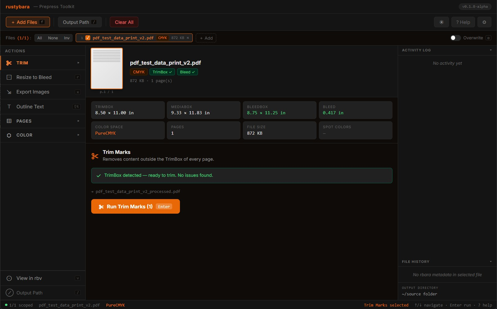

# Rustybara

<!--  -->
<p align="center">
    
</p>

**Prepress-focused PDF manipulation toolkit for graphic designers and print operators.**

[](https://crates.io/crates/rustybara)
[](https://docs.rs/rustybara)
[](LICENSE-LGPL-3.0)

Rustybara is the convergence of three standalone prepress CLI tools into a
unified Rust library and interactive toolset, built on the same primitives
those tools proved in production:

| Origin Tool                   | Primitive                                       |
| ----------------------------- | ----------------------------------------------- |
| `pdf-mark-removal`            | Content stream filtering, CTM math              |
| `resize_to_bleed_or_trim_pdf` | Page box geometry (MediaBox, TrimBox, BleedBox) |
| `pdf-2-image`                 | PDF rasterization and image encoding            |

It ships as a library crate (`rustybara`), a CLI/TUI binary (`rbara`), and a
GPU-accelerated PDF page viewer (`rbv`).

---

## Workspace

| Crate            | Description                                   | License |
| ---------------- | --------------------------------------------- | ------- |
| `rustybara`      | Core PDF manipulation library                 | LGPLv3  |
| `rustybara-icc`  | ICC color management — 22 bundled profiles    | LGPLv3  |
| `rustybara-wasm` | WebAssembly bindings — browser, Node.js, edge | LGPLv3  |
| `rbara`          | Terminal UI (Ratatui TUI)                     | GPLv3   |
| `rbara-gui`      | Native desktop GUI (Tauri v2)                 | GPLv3   |
| `rbv`            | Prepress PDF viewer (Skia + OpenGL + winit)   | GPLv3   |

---

## Features

| Feature                        | rustybara | rustybara-icc | rustybara-wasm |
| ------------------------------ | --------- | ------------- | -------------- |
| Page trim & resize             | ✓         | —             | ✓              |
| CMYK remap                     | ✓         | —             | ✓              |
| Split / stitch pages           | ✓         | —             | —              |
| Extract page ranges            | ✓         | —             | —              |
| Flatten spot colors            | ✓         | —             | —              |
| Rasterization (pdfium)         | ✓         | —             | —              |
| XMP metadata embed & read      | ✓         | —             | —              |
| Page object tree + hit-testing | ✓         | —             | —              |
| Plate separation filtering     | ✓         | —             | —              |
| Outline text (glyph → paths)   | ✓         | —             | —              |
| ICC color transforms           | —         | ✓             | —              |
| WebAssembly / browser          | —         | —             | ✓              |
| Node.js / edge runtime         | —         | —             | ✓              |

- **Pipeline API** — Chain operations fluently: `open → trim → resize → remap → save`.
- **Batch processing** — Process entire directories of PDFs from CLI or TUI.
- **Interactive TUI** — App-style terminal interface for designers who prefer guided
  workflows over raw CLI flags. Configurable output directory.
- **Prepress vocabulary** — Every API surface speaks in boxes, bleeds, and DPI — not
  generic PDF primitives.

---

## Installation

Pre-built installers for `rbara` (the CLI/TUI binary) are published with each
release. Each installer bundles its own `pdfium` runtime — no system pdfium
needed.

### Windows

Download `rbara-setup-<version>-x64.exe` from the
[Releases page](https://github.com/Addy-A/rustybara/releases) and run it.
This is a per-user Inno Setup installer (no admin required) that installs to
`%LOCALAPPDATA%\Programs\rbara\`, registers an opt-in PATH entry, and adds
an Add/Remove Programs entry. SmartScreen may warn the first time — the
binary is currently unsigned.

### macOS

```sh
# Apple silicon
tar -xzf rbara-<version>-macos-arm64.tar.gz && cd rbara-<version>-macos-arm64
./install.sh        # installs to ~/.local

# Intel
tar -xzf rbara-<version>-macos-x86_64.tar.gz && cd rbara-<version>-macos-x86_64
./install.sh
```

The bundle is unsigned; `install.sh` strips the `com.apple.quarantine`
attribute automatically. To uninstall: `./uninstall.sh`.

### Linux (glibc x86_64)

```sh
tar -xzf rbara-<version>-linux-x64.tar.gz && cd rbara-<version>-linux-x64
./install.sh                       # ~/.local
sudo PREFIX=/usr/local ./install.sh   # system-wide
```

Tested on Ubuntu 22.04+, Debian 12+, Fedora 38+, RHEL 9+, Arch, openSUSE
Tumbleweed. Musl distros (Alpine) need a source build. To uninstall:
`./uninstall.sh`.

### Docker

```sh
docker pull ghcr.io/addy-a/rbara:latest

# CLI usage — bind-mount your working directory
docker run --rm -v "$PWD:/work" ghcr.io/addy-a/rbara:latest \
  trim /work/in.pdf -o /work/out.pdf
```

The image is ~175 MB (debian:bookworm-slim base) and runs as a non-root user.

### Building from source

See the [Contributing](#contributing) section. The maintainer-side installer
scripts live in [`installer/`](installer/) (one subdir per platform, each
with its own README).

---

## Quick Start

### As a library

Add to your `Cargo.toml`:

```toml
[dependencies]
rustybara = "0.1"
```

```rust
use rustybara::PdfPipeline;

fn main() -> rustybara::Result<()> {
    // Trim marks, resize to 9pt bleed, save
    PdfPipeline::open("input.pdf")?
        .trim()?
        .resize(9.0)?
        .split_pages(5.83 * 72.0)? // split spreads into 5.83" panels
        .save_pdf("output.pdf")?;

    Ok(())
}
```

### Rasterize a page

```rust
use rustybara::{PdfPipeline, encode::OutputFormat, raster::RenderConfig};

fn main() -> rustybara::Result<()> {
    let pipeline = PdfPipeline::open("input.pdf")?;
    let config = RenderConfig::prepress(); // 300 DPI

    pipeline.save_page_image(0, "page_1.jpg", &OutputFormat::Jpg, &config)?;
    Ok(())
}
```

### Embed XMP provenance metadata

```rust
use rustybara::{PdfPipeline, xmp};

fn main() -> rustybara::Result<()> {
    let source_hash = xmp::hash_file(std::path::Path::new("input.pdf"))?;
    let timestamp = "2026-05-28T12:00:00Z".to_string();

    PdfPipeline::open("input.pdf")?
        .trim()?
        .resize(9.0)?
        .embed_metadata(&source_hash, &timestamp, &[("trim", ""), ("resize", "bleed_pts=9")])?
        .save_pdf("output.pdf")?;
    Ok(())
}
```

### Inspect the page object tree

```rust
use rustybara::{PdfPipeline, objects::tree::build_object_tree};

fn main() -> rustybara::Result<()> {
    let pipeline = PdfPipeline::open("input.pdf")?;
    let page_id = pipeline.doc().get_pages()[&1];
    let tree = build_object_tree(pipeline.doc(), page_id)?;

    for obj in &tree.objects {
        println!("{:?}  bbox={:?}", obj.kind, obj.bbox);
    }
    Ok(())
}
```

### CLI

```sh
# Trim print marks
rbara trim input.pdf

# Resize to 9pt bleed
rbara resize --bleed 9.0 input.pdf

# Export pages as 300 DPI PNGs
rbara image --format png --dpi 300 input.pdf

# Remap a CMYK color (rich black → 60/40/20/100)
rbara remap-color --from 1.0 1.0 1.0 1.0 --to 0.6 0.4 0.2 1.0 input.pdf
```

### TUI

Launch `rbara` with no arguments to enter the interactive terminal interface:

```sh
rbara
```

Arrow keys navigate, Enter selects, Esc goes back. Single-letter shortcuts are
shown in the footer bar. Press `?` for the full keyboard reference.

---

## rustybara-wasm

WebAssembly bindings for rustybara. Run PDF manipulation in any JavaScript
or TypeScript environment — browser, Node.js, Deno, or Cloudflare Workers —
with no native dependencies.

**Exposes the pure-Rust pipeline subset:**

- `trim()` — strip content outside TrimBox
- `resize(bleed_pts)` — expand page boxes by a bleed margin
- `remap_color(from, to, tolerance)` — substitute CMYK values in content streams
- `to_pdf_bytes()` — serialize result as bytes for download or further processing

Rasterization (pdfium), XMP embedding, object tree, and ICC color transforms (lcms2)
require the native crate and are not available in the wasm build.

### Browser quickstart

```js
import init, { PipelineHandle } from './pkg/rustybara_wasm.js'

await init('./pkg/rustybara_wasm_bg.wasm')

const bytes = new Uint8Array(
  await fetch('input.pdf').then((r) => r.arrayBuffer()),
)
let handle = new PipelineHandle(bytes)
handle = handle.trim()
handle = handle.resize(8.504)
const result = handle.to_pdf_bytes()
```

### Build

```bash
cd rustybara-wasm
wasm-pack build --target web --out-dir pkg --release
```

### npm

npm distribution coming soon. Pre-built artifacts are available via the
[rustybara playground](https://rustybara.com/playground) on the marketing site.

---

## Architecture

### Module Map

```
rustybara/src/
  lib.rs          — Public re-exports
  pipeline.rs     — PdfPipeline: high-level chaining API
  error.rs        — Unified error type
  xmp.rs          — XMP metadata embedding, reading, and SHA-256 provenance hashing
  geometry/
    rect.rs       — Rect (position + dimensions, PDF coordinate system)
    matrix.rs     — Matrix (2D affine CTM transformations)
  pages/
    boxes.rs      — PageBoxes: TrimBox, MediaBox, BleedBox, CropBox reader
    split.rs      — Page extraction and splitting utilities
    stitch.rs     — Spread stitching utilities
    layout.rs     — Page layout helpers
  stream/
    filter.rs     — ContentFilter: CTM-walking content stream filter
    color_ops.rs  — ColorRemap: CMYK→CMYK value substitution in content streams
  objects/
    tree.rs       — build_object_tree: full page object list (paths, images, text)
                    with color, CTM, overprint state, and subpath geometry
    hittest.rs    — Spatial hit-testing against the ObjectTree
    separation.rs — filter_by_ink: plate isolation by CMYK channel or spot name
  outline/        — (feature-gated: "outline")
    font.rs       — Extract raw font bytes from PDF resource dictionaries
    encoding.rs   — Resolve character codes to GlyphId
    paths.rs      — outline_page_text: walk content stream → per-glyph path geometry
    writer.rs     — glyphs_to_content_stream: serialize glyphs back to PDF operators
  raster/
    render.rs     — PageRenderer trait, CpuRenderer (pdfium-render)
    config.rs     — RenderConfig (DPI, annotation toggles)
  encode/
    save.rs       — OutputFormat enum, image encoding (JPG/PNG/WebP/TIFF)
  color/          — (feature-gated: "color")
    icc.rs        — Re-exports from rustybara-icc crate
    transform.rs  — Re-exports from rustybara-icc crate

rustybara-icc/src/  (separate crate, optionally used via "color" feature)
  lib.rs          — ICC color management engine
  color_space.rs  — ColorSpaceKind enum (CMYK, RGB, Gray, Lab)
  error.rs        — IccError type for color operations
  intent.rs       — RenderingIntent enum for ICC transforms
  pixel_format.rs — PixelFormat enum (RGB8, CMYK8, etc.)
  transform.rs    — ColorTransform: pixel-level ICC profile transforms
  pdf.rs          — PdfColorConverter: document-level color space conversion
  profiles/       — Bundled ICC profiles (FOGRA39, GRACoL2006, etc.)
```

### Public API

`rustybara` is a high-level, prepress-scoped crate. The public API speaks in
prepress vocabulary:

```rust
// Prepress operations
PdfPipeline::open(path)?
    .trim()?                    // Remove content outside TrimBox
    .resize(bleed_pts)?         // Expand page boxes by bleed margin
    .remap_color(from, to, tolerance)?  // Substitute CMYK values
    .add_trim_box(bleed_pts)?   // Inset MediaBox to set a TrimBox
    .embed_metadata(hash, ts, ops)?     // Embed rbara: XMP provenance block
    .save_pdf(path)?;           // Write the result

// Rasterization
pipeline.render_page(0, &config)?;                          // → DynamicImage
pipeline.save_page_image(0, path, &format, &config)?;       // → file

// Page operations
let new_pipeline = pipeline.extract_pages(&[0, 2, 4])?;    // → new pipeline
let spreads      = pipeline.split_pages(panel_width_pts)?;  // → new pipeline
let stitched     = pipeline.stitch_pages(spread_width_pts)?;// → new pipeline

// Page inspection
let boxes = PageBoxes::read(&doc, page_id)?;
boxes.trim_or_media()           // TrimBox if present, else MediaBox
boxes.bleed_rect(9.0)           // Expand trim by bleed amount

// XMP provenance
let hash = xmp::hash_file(path)?;                           // sha256:<hex>
let block = pipeline.read_xmp_block();                      // Option<RbaraXmpBlock>

// Object tree (paths, images, text — full geometry + color)
let tree = objects::tree::build_object_tree(doc, page_id)?;
let plate_objs = objects::separation::filter_by_ink(
    &tree,
    &InkSelector::CmykChannel(CmykChannel::Cyan),
);

// Text outline extraction (requires "outline" feature)
#[cfg(feature = "outline")]
{
    use rustybara::outline::{outline_page_text, writer::glyphs_to_content_stream};
    let glyphs = outline_page_text(doc, page_id)?;
    let pdf_ops = glyphs_to_content_stream(&glyphs);  // → PDF path operators
}

// Color space conversion (requires "color" feature)
#[cfg(feature = "color")]
{
    use rustybara::color::{ColorTransform, RenderingIntent, profiles};

    let transform = ColorTransform::new(
        &profiles::COATED_FOGRA_39,
        &profiles::COATED_GRACOL_2006,
        RenderingIntent::RelativeColorimetric,
    )?;

    pipeline.convert_color_space(&transform)?;  // Convert entire document
}
```

### Feature Flags

| Flag      | What it enables                                       | Default |
| --------- | ----------------------------------------------------- | ------- |
| `raster`  | `pdfium-render`, `image`, `webp` — page rasterization | ✓       |
| `outline` | `ttf-parser` — text outline / glyph-path extraction   | ✓       |
| `color`   | `rustybara-icc` / `lcms2` — ICC color management      | —       |
| `wasm`    | WebAssembly build gate                                | —       |
| `gpu`     | Reserved for future GPU renderer                      | —       |

### Renderer Trait

Rendering is behind a trait for future GPU backend support:

```rust
pub trait PageRenderer {
    fn render(&self, page: &PdfPage, config: &RenderConfig)
        -> Result<DynamicImage>;
}

pub struct CpuRenderer;   // pdfium-render — ships today
// pub struct GpuRenderer; // vello/wgpu — future work
```

---

## Dependencies

| Crate                                                                              | Role                                                         |
| ---------------------------------------------------------------------------------- | ------------------------------------------------------------ |
| [`lopdf`](https://docs.rs/lopdf) 0.40                                              | PDF object graph manipulation                                |
| [`pdfium-render`](https://docs.rs/pdfium-render) 0.9                               | PDF rasterization via PDFium                                 |
| [`image`](https://docs.rs/image) 0.25                                              | Bitmap encoding (JPEG, PNG, WebP, TIFF)                      |
| [`rayon`](https://docs.rs/rayon) 1.11                                              | Parallel page rendering                                      |
| [`ttf-parser`](https://docs.rs/ttf-parser) 0.25                                    | TrueType glyph outline extraction (`outline` feature)        |
| [`uuid`](https://docs.rs/uuid) 1                                                   | UUID v4 generation for XMP provenance                        |
| [`sha2`](https://docs.rs/sha2) 0.11                                                | SHA-256 source file hashing for XMP provenance               |
| [`rustybara-icc`](https://github.com/Addy-A/rustybara/tree/main/rustybara-icc) 0.1 | ICC color management (optional, `color` feature)             |
| [`lcms2`](https://docs.rs/lcms2) 6.1                                               | Little CMS color engine (via rustybara-icc, `color` feature) |

### Runtime Requirement — PDFium

The `render_page` and `save_page_image` functions require the PDFium shared library
at runtime. Place the appropriate binary alongside your executable:

| Platform | File              |
| -------- | ----------------- |
| Windows  | `pdfium.dll`      |
| macOS    | `libpdfium.dylib` |
| Linux    | `libpdfium.so`    |

Pre-built binaries: [pdfium-binaries](https://github.com/bblanchon/pdfium-binaries)

> **Note:** End-users of the `rbara` binary do **not** need to do this manually
> — the [pre-built installers](#installation) bundle the matching pdfium for
> each platform. This requirement applies only when consuming `rustybara` as a
> library in your own Rust project.

Operations that do not rasterize (`trim`, `resize`, `save_pdf`, `page_count`,
`PageBoxes::read`, `build_object_tree`, `embed_metadata`) work without PDFium.

---

## rbara — CLI & TUI Binary

`rbara` is the interactive front-end for `rustybara`. It provides both a
flag-based CLI for scripting and a TUI for guided workflows.

### Keyboard Reference (TUI)

| Key             | Action                     |
| --------------- | -------------------------- |
| `t`             | Trim print marks           |
| `r`             | Resize to bleed            |
| `x`             | Export to image            |
| `m`             | Remap colors               |
| `c`             | Convert color space        |
| `s`             | Flatten spot colors        |
| `b`             | Add trim box               |
| `p`             | Split pages                |
| `g`             | Stitch pages               |
| `e`             | Extract pages              |
| `/`             | Output path                |
| `o`             | Toggle overwrite mode      |
| `f`             | Add files                  |
| `a` / `n` / `i` | Scope all / none / invert  |
| `v`             | View active file in rbv    |
| `Enter`         | Run active action          |
| `:`             | Open command bar           |
| `?`             | Keyboard reference overlay |

### UX Model

The TUI follows an app-style keyboard model — arrow keys, Enter, Esc — designed
for designers who have never used a terminal before. Vim-style bindings may be
layered on as aliases in a future version.

File-first workflow: launch → select file or directory → commands become
available. Directories auto-glob `*.pdf` files.

---

## rbv — PDF Page Viewer

`rbv` is a prepress-focused PDF viewer built on Skia (OpenGL) + winit. It is
designed for quick go/no-go QC decisions — bleed check, color space, spot ink
declaration — not sub-pixel vector fidelity. Pages are rasterized by pdfium and
displayed as a bitmap; the object tree layer adds wireframe, hit-testing, and
color diagnostics on top.

```
rbv <file> [page] [--dpi <dpi>]
```

The initial preview renders at 72 DPI for fast startup, then a full-resolution
render (at the specified DPI, default 300) replaces it in the background.

### Keyboard Shortcuts

| Key                     | Action                                         |
| ----------------------- | ---------------------------------------------- |
| `W`                     | Toggle wireframe mode                          |
| `O`                     | Toggle prepress box overlays (bleed/trim/crop) |
| `Ctrl + =` / `Ctrl + +` | Zoom in                                        |
| `Ctrl + -`              | Zoom out                                       |
| `Ctrl + 0`              | Reset zoom and pan                             |
| `Ctrl + Scroll`         | Zoom toward cursor                             |
| Left drag               | Pan                                            |
| Left click              | Select object + sample color                   |
| `H` / `←` / `K` / `↑`   | Previous page                                  |
| `L` / `→` / `J` / `↓`   | Next page                                      |
| `Ng`                    | Jump to page N (e.g. `5g`)                     |
| `Ctrl+Shift+D`          | Toggle debug overlay                           |
| `Ctrl+Shift+E`          | Export wireframe diagnostic PDF                |
| `Esc`                   | Exit                                           |

### Wireframe Mode

`W` replaces the raster image with a vector outline view derived from the page's
`ObjectTree`. Every path, image, and text block is drawn as a thin black stroke
in page-space coordinates. The selected object receives a 2px blue highlight.
Glyph outlines (extracted via `outline_page_text`) are drawn on top when
available. `Ctrl+Shift+E` exports the wireframe geometry to a diagnostic PDF
for cross-referencing with `qpdf --qdf`.

### Color Diagnostics

Left-click any area to sample:

- **Pixel RGBA** — what the monitor is displaying (sampled from the rasterized bitmap)
- **PDF color** — the declared fill/stroke color of the hit object from the content stream (`DeviceGray` / `DeviceRGB` / `DeviceCMYK` / `Separation`)
- **ICC CMYK** — the pixel RGB converted to CMYK via Little CMS 2 (destination: US Web Coated SWOP)

A crosshair marker is stored in PDF coordinates and projected to screen each
frame, so it stays locked to the correct page position as you zoom and pan.

### File Watching

rbv monitors the opened file via `notify`. When the file changes on disk (e.g.
after an InDesign export), it automatically re-opens the document, rebuilds the
object tree, and re-renders — supporting a save-and-preview loop without
restarting.

### IPC

`rbara-gui` can send commands to a running rbv instance (e.g. switch to a
different file after processing). rbv accepts these via a local IPC channel
when launched with `--listen`.

---

## Known Limitations

| Limitation                         | Notes                                                                                                 |
| ---------------------------------- | ----------------------------------------------------------------------------------------------------- |
| sRGB rasterization only            | CMYK→sRGB via PDFium. ICC color transforms available via `color` feature for stream-level operations. |
| JPEG quality not configurable      | Fixed encoder quality. `--quality` flag planned.                                                      |
| Spot color approximation           | PDFium renders spot inks as CMYK approximations.                                                      |
| No Form XObject ColorSpace pruning | Inherited limitation from content stream filtering.                                                   |
| `rbv` requires display server      | No headless preview. Graceful error on missing GPU.                                                   |
| `rbv` zoom quality                 | Raster-only rendering degrades past ~150–200% zoom. LOD tiling planned.                               |
| CFF / Type1 glyph outlines         | `ttf-parser` requires sfnt container; raw CFF fonts use a OTTO header shim with ongoing refinement.   |
| Very large PDFs (~200 MB+)         | Hard-blocked on add in `rbara-gui`. See below.                                                        |

### Large file handling

`rustybara` opens PDFs eagerly: `lopdf` parses the entire object graph into memory
on load, and the PDFium render path round-trips through a full document
serialization. For very large files (roughly **200 MB and up**, e.g. imposed
print runs of hundreds of pages) this parse can take tens of seconds and consume
multiple gigabytes of RAM — long enough to make the desktop app appear frozen.

We explored **splitting large files into page-range chunks** (processing each
independently) and **re-merging** the results into a single output. It worked
mechanically but didn't hold up as a real solution: chunking still pays the full
parse cost, the merge re-materializes the whole document in memory, and neither
approaches the performance of mature tools like Acrobat or PitStop, which use
lazy/random-access parsing. That experiment has been removed.

For now, `rbara-gui` **hard-blocks files above a configurable size limit**
(default 200 MB, set in *Settings → Behavior*; `0` disables the limit at your own
risk) and surfaces a clear warning rather than freezing. The underlying library
operations remain available for callers who can afford the memory/time.

A proper fix — lazy/streaming parse and metadata extraction that never loads the
whole document — is planned for a future release (see Roadmap).

---

## Roadmap

- [x] ICC color management (`color` module via `lcms2`) — v0.1.2
- [x] CMYK→CMYK color remapping in content streams — v0.1.2
- [x] Cross-platform installers (Windows / macOS / Linux / Docker) with bundled pdfium — v0.1.3
- [x] GitHub Actions release pipeline (one tag → all installers + GHCR image) — v0.1.3
- [x] `rbv` GPU-accelerated page viewer (wgpu + winit) — v0.1.4
- [x] `rbara-gui` native desktop GUI (Tauri v2) — v0.1.4
- [x] Split Pages — divide spreads into individual panels at a configurable width — v0.1.5
- [x] Stitch Pages — combine panels back into spreads at a configurable spread width — v0.1.5
- [x] Extract Pages — extract arbitrary page ranges into a new PDF — v0.1.5
- [x] Flatten Spot Colors — flatten spot color inks to CMYK process — v0.1.5
- [x] Command bar (`:` mode) with chord shortcuts and live preview — v0.1.5
- [x] Page object tree with spatial hit-testing — v0.1.6
- [x] Wireframe mode in `rbv` (Skia/OpenGL renderer) — v0.1.6
- [x] Color diagnostics panel with ICC pixel sampling — v0.1.6
- [x] Outline Text — vectorize embedded TrueType glyphs to PDF path operators — v0.1.6
- [x] Plate separation filtering (`filter_by_ink`, `InkSelector`) — v0.1.6
- [x] Wireframe diagnostic PDF export — v0.1.6
- [x] File watching / live reload in `rbv` — v0.1.6
- [x] XMP provenance metadata embedding and reading (`rbara:` namespace) — v0.1.7
- [x] Tile rendering system in `rbv` for large pages — v0.1.7
- [x] Resizable panels and activity log in `rbara-gui` — v0.1.7
- [x] Rotate PDF (`/Rotate` page action) — v0.1.9
- [x] Set Media Box action — v0.1.9
- [x] Configurable JPEG/WebP export quality — v0.1.9
- [x] System / network print for fast proofs — v0.1.9
- [x] Fix: macOS `rbv` dock-icon / defunct process on exit (clean `event_loop.exit()` + child reaping) — v0.1.9
- [x] Fix: Windows `rbv` console window on launch (`windows_subsystem`) — v0.1.9
- [x] RGB→CMYK conversion (vector graphics + embedded images)
- [x] Spot color detection service
- [x] LOD-aware zoom tiling in `rbv`
- [ ] PDF/X validation and preflight reports
- [ ] Configurable JPEG quality (`--quality` flag)
- [ ] Lazy / streaming PDF parsing for large files (remove the hard size block)

---

## Contributing

```sh
cargo test --workspace
```

- MSRV is Rust 1.85 (edition 2024). Do not raise this floor without discussion.
- **Targets:** `x86_64`, `aarch64`, `wasm32-unknown-unknown` (via rustybara-wasm)
- The TrimBox is always the source-of-truth reference box. It is never modified
  by any operation.
- Public API additions require documentation and at least one integration test.
- The app-style keyboard model is the UX baseline for `rbara`. Modal bindings
  are opt-in aliases only.

### Cutting a release

Releases are fully automated by [`.github/workflows/release.yml`](.github/workflows/release.yml).
To cut a new version:

1. Bump `version` in `rbara/Cargo.toml` (and `rustybara/Cargo.toml` if the lib changed).
2. Commit and push.
3. Tag and push the tag:
   ```sh
   git tag v0.1.7
   git push --tags
   ```
4. The workflow will build the Windows installer, the Linux tarball, both
   macOS tarballs (Apple silicon + Intel), and the Docker image, then create
   a GitHub Release with all artifacts and a `SHA256SUMS.txt` attached.

The pdfium chromium build is pinned via `PDFIUM_CHROMIUM` env var in the
workflow (currently `7776`). Bump it there to refresh pdfium across all
artifacts in lockstep.

---

## Playground

Try rustybara-wasm live in the browser at [rustybara.com/playground](https://rustybara.com/playground).
Upload a PDF or use a sample file — trim, resize, and remap CMYK values entirely
client-side via WebAssembly. No account, no upload, no server.

---

## License

- **`rustybara` (library):** [LGPL-3.0-only](LICENSE-LGPL-3.0)
- **`rbara` and `rbv` (binaries):** [GPL-3.0-only](LICENSE-GPL-3.0)

The LGPL license on the library allows downstream tools to link against
`rustybara` without copyleft obligations on their own code, while the
binaries remain fully copyleft.

Copyright (c) 2026 Addy Alvarado
